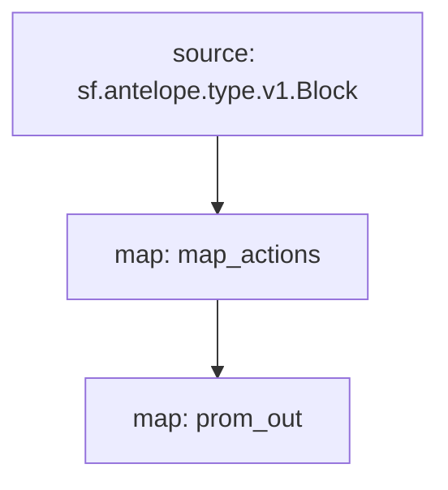

# `Yield+` Substream

> Metrics for [Yield+](https://tokenyield.io).

### [Latest Releases](https://github.com/eosnetworkfoundation/eosio.yield-substreams/releases)

### Sinks
- [Prometheus](https://github.com/pinax-network/substreams-sink-prometheus.rs)

### Quickstart

```bash
$ make
$ make gui
```

### Mermaid graph



Here is a quick link to see the graph:

https://mermaid.live/edit#pako:eJx0jk1qxDAMRq9itM6YKd15dmVu0O7iEISt_NDYMo5cCCF3LySEhsIs9Xg8fSs49gQG-oxpUF_Ph41KBUwtOhk5znXAZK6g2Y250xiFJk6kZUmkf970x8Tuu565ZEfmtdGo282W-_2drtm9mjKHloscT8-r-b_pL3AqDxuhgkA54OjBwGpBBgpkwVjw1GGZxMIGFWAR_lyiAyO5UAUleRR6jthnDAfcfgMAAP__C8VhpA

### Modules

```yaml
Package name: eosio_yield
Version: v0.1.0
Doc: Metrics for Yield+
Modules:
----
Name: map_actions
Initial block: 0
Kind: map
Output Type: proto:eosio.yield.v1.Actions
Hash: 1457c45689009e9da71fc60c6f6625693b4ef74b

Name: prom_out
Initial block: 0
Kind: map
Output Type: proto:pinax.substreams.sink.prometheus.v1.PrometheusOperations
Hash: d91b26b8ff92dd40f442e462ae103255978d5437
```